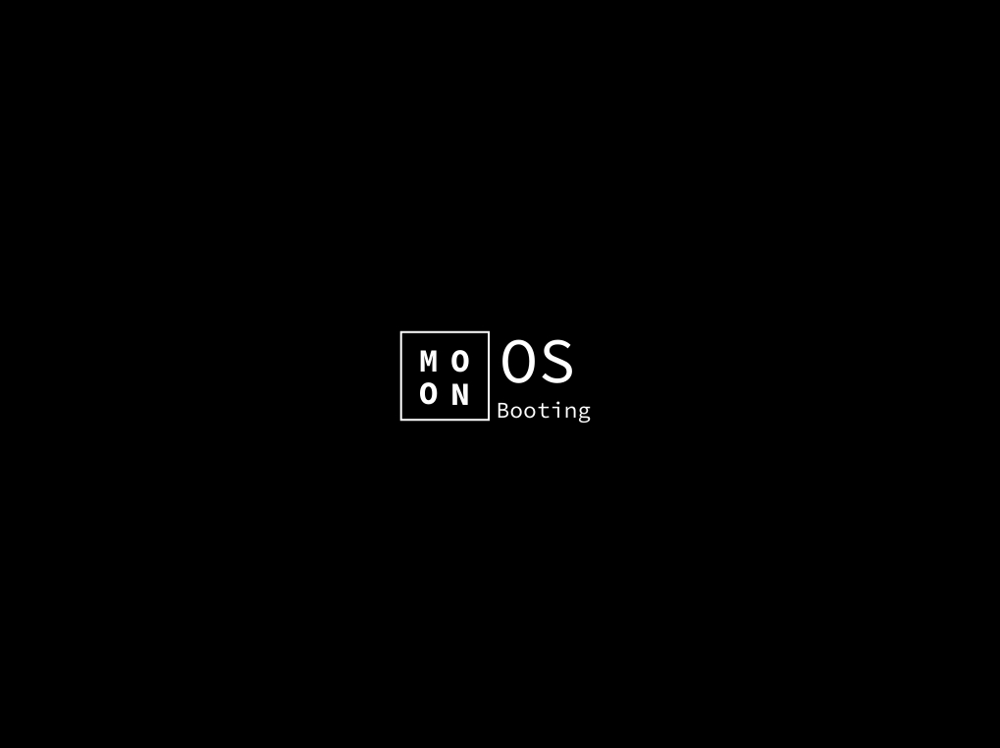
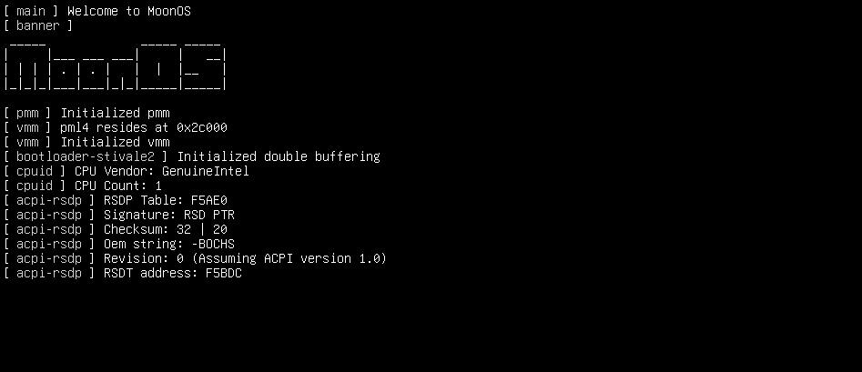
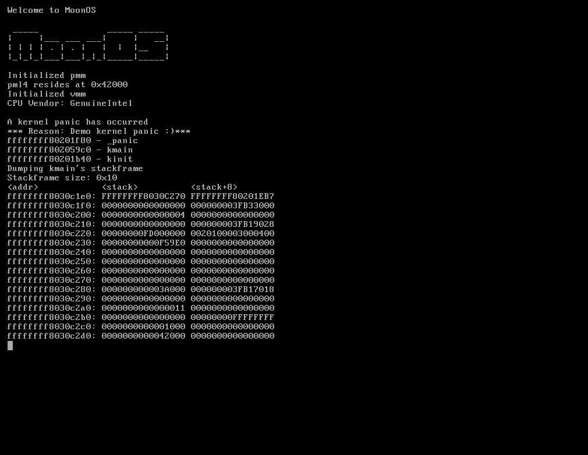

# Moon OS

<h2 align="center"> Moon OS is a modular micro-kernel targeting the x86_64 architecture, aiming to be POSIX-like in the future. </h2>

# Screenshots:
Bootsplash:

 
Verbose boot:

 
Kernel panic:

 

# Features
- Support for 4 and 5 level paging
- Stacktrace/symbol backtrace
- ubsan
- Basic image rendering (Raw pixel data header file generated by https://github.com/V01D-NULL/img2c)
- Set verbose or quiet boot in the bootloader config file (limine.cfg).
- Elf loader
- bitmap, buddy and slab allocators.

# Future features:
- kasan
- APIC
- ACPI
- FADT
- MADT
- SMBIOS
- Kernel heap
- Userland support
- Multitasking
- Many hardware drivers including but not limited to:
	- Network cards
	- ATA
	- GPU's
	- And much more
- A libc for the userland

# This is currently being working on:
- Scheduler
- Syscalls
- Threads

# Directory walkthrough:
- libs/   	  --  Here you will find kernel libs.
- kernel/ 	  --  Kernel source code, this is most likely all you really care about
- build-util/ --  3rd party tools needed to build the Moon kernel + makefile flags
- debug-util/ --  Files needed for debugging Moon.
- boot/		  --  Everything Moon needs in order to boot 

# Installation
## Building: (assuming you are using a debian based distro)
- Install needed tools:
	- sudo apt update
	- sudo apt install gcc nasm qemu-system-x86 libfuse-dev
- Build kernel
	- `make all` -- Build the kernel to an ISO file
	- `make run` -- Run the kernel in qemu and build it if necessary
	- `make kvm` -- Run the kernel in qemu with kvm and build it if necessary
	- Command line options for `kvm` and `run`:
		- `modern=yes` -- Emulate modern features (5 level paging for example and uefi just to name a few)

# My journey: (Inspiration for newcomers)
I have always wanted to make an OS, so one day I decided to build one.
Turns out it is a lot of work and back then it totally overwhelmed me to the point where I took long breaks (for months) because information was so scarce, and what little information there is is outdated.

I have written about 4 "kernels" during my OS development learning experience, and each time I started over because I was far too overwhelmed- none have gotten past a GDT :/   (heck, some where just bootloaders that called a kernel entry and looped)

If you are a beginner looking to understand what this code is doing and how you can write your own kernel with up-to-date information, please do join the OSDEV discord server (linked in the osdev wiki at the bottom) and don't give up when it gets hard at first.

I have started developing kernels about 8 months ago at the time of writing (with multiple month-long of breaks in between), and I still have many things to learn, however my `try harder` mindset proved useful in helping me get through the struggles and write a kernel for which I did not have to steal or copy code from tutorials or other projects out of a lack of knowledge.

I hope this inspired you to use this mindset when things seem too difficult to manage.

Best of luck ~ V01D (Tim).

# Special thanks
- Thanks go out to websites like lowlevel.eu or the osdev wiki but also some cool and really helpful os developers on github and discord.

# Finishing touch (resources I use)
* https://www.cs.cmu.edu/~ralf/files.html
* https://ethv.net/workshops/osdev/notes/notes-3.html
* https://osdev.wiki  (barebones but up-to-date osdev wiki)
* https://wiki.osdev.org
